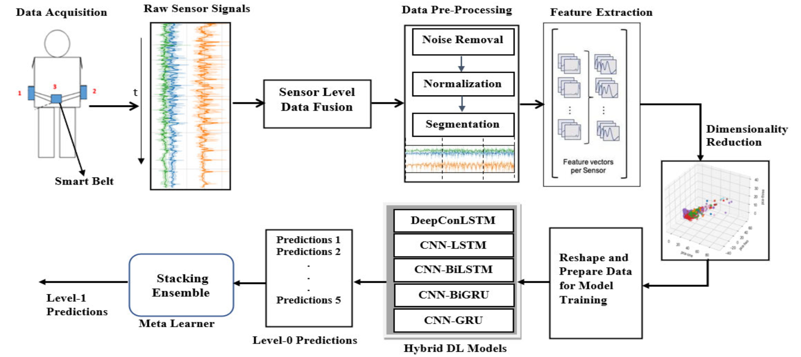

# Ensemble Deep Learning for Human Activity Recognition (HAR)

This repository contains the official code used in the published study:

> **"Efficient Human Gait Activity Recognition Based on Sensor Fusion and Intelligent Stacking Framework"**  
> Adane Tarekegn, Mario Giacobini, Gashaw Mamo, Ermias Asfaw  
> *Published 2023*  
> [DOI: 10.1007/978-3-031-29695-1_17](https://doi.org/10.1109/JSEN.2023.3319353)

---

## Highlights

- Hybrid deep learning models: **CNN-BiGRU**, **CNN-BiLSTM**, **CNN-LSTM**, and **CNN-GRU**
- **Stacked ensemble** learning using predictions from deep models
- **Meta-learners**: Random Forest and Gradient Boosting (with GridSearchCV)
- State-of-the-art accuracy on **multiple HAR datasets**
- Visualizations: confusion matrix heatmaps and classification reports

---

## Models Included

| Model Notebook                          | Description                         |
|----------------------------------------|-------------------------------------|
| `CNN-GRU_Model_train_WISDM_500.ipynb`  | CNN with GRU                        |
| `CNN-LSTM_Hybrid_model_500.ipynb`      | CNN with LSTM                       |
| `CNN-BiGRU_Hybrid_model_500.ipynb`     | CNN with Bi-directional GRU         |
| `CNN-BiLSTM_Hybrid_model_500.ipynb`    | CNN with Bi-directional LSTM        |
| `1__Stacked_ensemble_hybrid_model.ipynb`| Final ensemble using RF and GBoost |

---
## Datasets Used

This study evaluated the proposed hybrid deep ensemble model on three datasets:

### 1. WISDM v1.1
- Smartphone accelerometer data
- 6 activity classes: Walking, Jogging, Upstairs, Downstairs, Sitting, Standing
- Sampling rate: 20 Hz
- Used **undersampling** for class balancing
- WISDM Dataset Dataset link : https://www.cis.fordham.edu/wisdm/dataset.php
  
### 2. UCI HAR
- IMU data (accelerometer + gyroscope) from smartphones
- 6 activities: Walking, Upstairs, Downstairs, Sitting, Standing, Lying
- Sampling rate: 50 Hz
- Preprocessed and balanced → no resampling needed
- UCI HAR Dataset Dataset link: https://archive.ics.uci.edu/dataset/240/human+activity+recognition+using+smartphones

### 3. Smart Belt Dataset
- Collected from 12 participants using a custom belt with 3 IMU sensors (sampling rate: 100 Hz)
- Activities: Walking, walking upstairs/downstairs, sitting, standing, lying
- Annotated using [**NOVA**](https://github.com/hcmlab/nova)
- Dataset available in the [`Datasets/`](./Datasets/) folder (`smart_belt_dataset.csv`)  
  or externally from the [ALAMEDA Project](https://alamedaproject.eu/)
- Oversampling applied to balance activity classes

---
## Framework Overview

The architecture of the WS-HGAR model, combining sensor fusion, hybrid deep learning, and stacking ensemble:



*Figure 1: End-to-end structure of the proposed WS-HGAR model as described in the paper.*

## Results

| Model             | Accuracy   |
|------------------|------------|
| CNN-BiGRU         | ~99.91%    |
| CNN-LSTM          | ~99.91%    |
| CNN-BiLSTM        | ~99.87%    |
| **Stacked Ensemble** | **99.96%** |

Confusion matrix heatmaps and classification reports are generated in each notebook.

---

## How to Run

Clone the repository:

```bash
git clone https://github.com/AdaneNT/Ensemble-Deep-Learning.git
cd Ensemble-Deep-Learning
```

Install dependencies:

```bash
pip install -r requirements.txt
```

Download the WISDM dataset and place `WISDM_ar_v1.1_raw.txt` in the project folder.

Launch Jupyter and run any model notebook:

```bash
jupyter notebook CNN-BiGRU_Hybrid_model_500.ipynb
```

For the ensemble model:

```bash
jupyter notebook 1__Stacked_ensemble_hybrid_model.ipynb
```

---

## 📖 Citation

If you use this work, please cite the paper:

```bibtex
@inproceedings{tarekegn2023gait,
  title={Efficient Human Gait Activity Recognition Based on Sensor Fusion and Intelligent Stacking Framework},
  author={Tarekegn, Adane and Giacobini, Mario and Mamo, Gashaw and Asfaw, Ermias},
  booktitle={Innovations in Bio-Inspired Computing and Applications},
  pages={179--190},
  year={2023},
  publisher={Springer}
}
```
[DOI: 10.1007/978-3-031-29695-1_17](https://doi.org/10.1007/978-3-031-29695-1_17)
